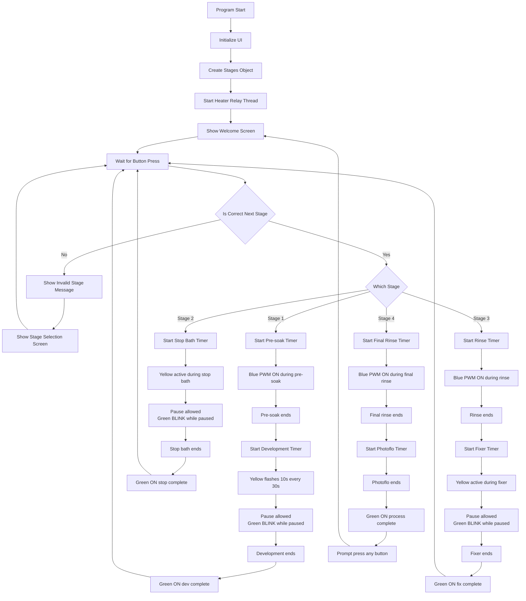

# Overview

This project is a **B&W Film Development Control System** using a **Raspberry Pi**. Using a couple hardware components and Python, this system manages timers for the different stages of film development, and maintains a constant temperature for the chemicals used. 

# Hardware 
**Component List**

 - 1 x Raspberry Pi 5
 - 1 x 20x4 I2C LCD
 - 1 x DS18B20 Waterproof digital temperature sensor
 - *Optional*: 1 x Wiring adapter for DS18B20. Use a 4.7K resistor if not.
 - 1 x Aquarium heater, 25W
 - 1 x 1x4 Keypad or 4 x push buttons
 - 1 x Rotary Encoder 
 - 1 x 1-Channel relay module
 - 3 x LEDs (1 blue, 1 green, 1 yellow)
 - 3 x 220 $\Omega$ Resistors

**Wiring**
(https://app.cirkitdesigner.com/project/2f3ded7f-9144-401d-bc2a-959bdd5ca67e)

**Safety Warnings**
The wiring diagram shows an actual immersion heater, not an aquarium heater. **If using an immersion heater,** ***do not touch the water while it is on***. I do not recommend using one for that exact reason. 

If you're following my design and you're using an **aquarium heater**, ensure it is ***fully submerged in water and not touching the walls of your container***. If it touches the walls it might create a hotspot and crack the glass or break it. 

When wiring the heater to the relay, ensure no wiring remains exposed after soldering. 

**Physical Setup**
Get a container large enough to hold all your chemistry. A 5 gallon aquarium or big, deep Pyrex should be good enough. Pop your aquarium heater on any of its inner walls, and fill it up until it fully covers it. Place the temperature probe in the water. Everything else should be placed in your line of view so you can always see the screen and LEDs, as well as handle the buttons at any time.
Place your chemistry bottles inside the water bath so they can be warmed up.

# Software

**Flowchart**

## File breakdown
   Each element of the hardware is controlled by a different file: 
 - tempcontrol.py: reads the data from the ds18b20 sensor and converts it to celsius. It periodically reads the temperature.
 - ledcontrol.py: manages the behavior of each LED: blue dims in and out, yellow blinks for 10 seconds every 30 seconds, green blinks or turns on depending on the stage
 - interfacing.py: controls anything related to the LCD 
 - relaycontrol.py: the relay drives the aquarium heater depending on a max and min temperature
 - stages.py: has the timer logic and contains the button handling for pausing the program in each stage. Sets the stage-dependent LED sequences

# Installation

 1. Enable I2C. Follow instructions found at [How to Configure I2C on Raspberry Pi – TheLinuxCode](https://thelinuxcode.com/configure-i2c-raspberry-pi/)
 2. Enable 1-Wire Interface. Follow instructions found on [Enable 1-Wire Interface on the Raspberry Pi - Raspberry Pi Spy](https://www.raspberrypi-spy.co.uk/2018/02/enable-1-wire-interface-raspberry-pi/)
 3. Make sure the Pi is acually reading the sensor by following the instructions detailed here: [Raspberry Pi Temperature Sensor using the DS18B20 - Pi My Life Up](https://pimylifeup.com/raspberry-pi-temperature-sensor/)
4. Clone *the-raspberry-pi-guy*'s github lcd repo by following the instructions on it: [lcd/README.md at master · the-raspberry-pi-guy/lcd](https://github.com/the-raspberry-pi-guy/lcd/blob/master/README.md)
5. Clone this repo on your own Raspberry Pi and run: `python3 main.py`

# Instructions
1. Press 1 to start the program. 
2. You will be prompted to set a development time. Rotate the encoder to set a base time, and press the encoder to confirm it.
4. You will be asked if you wish to Push or Pull your film. Rotate the encoder to +1 or +2 for pushing, and -1 or -2 for pulling. If you don't want to do either, select 0 and press the knob to continue.
5. You will be shown a screen confirming the settings and the final dev time. Press the knob to continue
6. From now on, the LCD will display the stage name, current temperature, and a timer. If the **blue LED** is on, you should be **pouring water** into the tank. If the **yellow LED** is on, **invert/agitate** the tank for as long as it is blinking. If the **green LED** is on, it means the **stage is done**.
7. Press the next button on the keypad to continue onto the next step
8. If at any point you wish to pause the program, hold the current stage button for a little over a second. The timer will pause, and the **green LED will blink** until you resume the program by holding that same button again. 
9. Upon completion of all 4 stages, press any button on the keypad to return to the welcome screen
